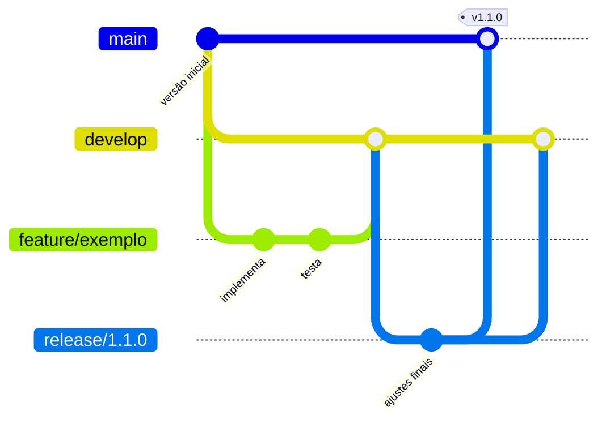

# Como contribuir

[← Voltar ao README](README.md)

Este repositório segue o **Git Flow**. Nenhuma alteração é feita diretamente na `main`: todo trabalho começa em uma branch própria e entra no projeto por **pull request**.

## Branches

| Branch | Origem | Destino | Para que serve |
|---|---|---|---|
| `main` | — | — | Versão estável e entregue. Cada versão recebe uma tag (`v1.0.0`, `v1.1.0`, …) |
| `develop` | `main` | — | Integração do trabalho em andamento |
| `feature/<descricao>` | `develop` | `develop` | Novas funcionalidades, experimentos e documentação |
| `release/<versao>` | `develop` | `main` e `develop` | Preparação de uma entrega |
| `hotfix/<descricao>` | `main` | `main` e `develop` | Correção urgente na versão entregue |



## Passo a passo de uma contribuição

```bash
# 1. Atualizar a develop
git checkout develop
git pull

# 2. Criar a branch da tarefa
git checkout -b feature/experimento-compressao

# 3. Trabalhar e registrar commits pequenos
git add <arquivos>
git commit -m "Adiciona comparação da MLP em float32 e INT8"

# 4. Enviar e abrir o pull request para a develop
git push -u origin feature/experimento-compressao
gh pr create --base develop
```

Depois da revisão por outra integrante, o pull request é integrado com **merge commit**, para preservar o histórico da branch. A branch da tarefa é apagada em seguida.

## Entregas (release)

```bash
git checkout develop && git pull
git checkout -b release/1.1.0
# apenas ajustes finais: versão, documentação, correções pequenas
git push -u origin release/1.1.0
gh pr create --base main
```

Depois do merge na `main`, crie a tag da versão e leve a release de volta para a `develop`:

```bash
git checkout main && git pull
git tag -a v1.1.0 -m "Versão 1.1.0"
git push origin v1.1.0
git checkout develop && git merge main && git push
```

## Padrões

- **Mensagens de commit** em português, no imperativo e com um assunto curto: `Adiciona…`, `Corrige…`, `Atualiza…`, `Remove…`.
- **Um assunto por pull request.** Descreva o que mudou, por que mudou e como foi testado.
- **Antes de abrir o pull request:**
  - Painel web: `npm test` e `npm run build` em `tinyml_ambiente/web`.
  - Pipeline de ML: `python training/pipeline.py` em `tinyml_ambiente`, quando o treinamento for alterado.
  - Firmware: compilar o ambiente PlatformIO alterado.
- **Nunca envie segredos** (`secrets.h`, `.secrets/`, tokens ou senhas de Wi-Fi).
- O **CI** executa os testes e o build do painel em todo pull request e em cada envio para `main` e `develop`.
