<p align="center">
  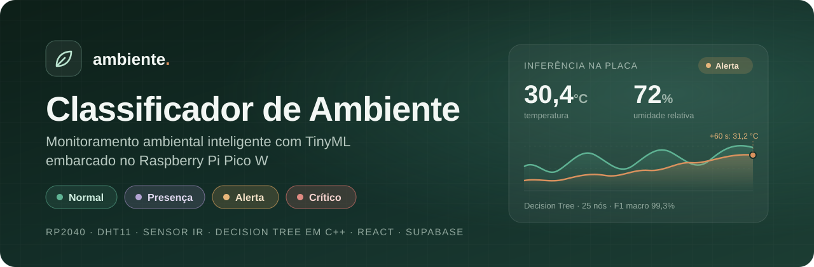
</p>

<p align="center">
  <a href="https://classificador-de-ambiente.vercel.app"></a>
  <a href="https://github.com/rafaelasantana-ia/classificador-de-ambiente/actions/workflows/ci.yml"></a>
</p>

<p align="center">
  
  
  
  
  
  
</p>

<p align="center">
  <b>Um microcontrolador de poucos dólares que entende o ambiente e decide sozinho quando alertar.</b><br>
  Leitura de sensores, inferência de Machine Learning e acionamento de alarmes acontecem <i>dentro da placa</i>,<br>
  sem depender de internet, servidor ou computador ligado.
</p>

<p align="center">
  <sub><b>SENAI Santa Catarina</b> · Pós-graduação em Inteligência Artificial Aplicada · IA Embarcada e Modelos Compactos</sub>
</p>

<h3 align="center">
  🌐 <a href="https://classificador-de-ambiente.vercel.app">Acesse o painel ao vivo → classificador-de-ambiente.vercel.app</a>
</h3>

---

## Sumário

- [Contexto e problema](#contexto-e-problema)
- [A solução](#a-solução)
- [Demonstração](#demonstração)
- [Do protótipo ao produto](#do-protótipo-ao-produto)
- [Arquitetura](#arquitetura)
- [Como o ambiente é classificado](#como-o-ambiente-é-classificado)
- [Resultados](#resultados)
- [Tecnologias](#tecnologias)
- [Como executar](#como-executar)
- [Estrutura do repositório](#estrutura-do-repositório)
- [Documentação completa](#documentação-completa)
- [Decisões técnicas: quantização e if/else](#decisões-técnicas-quantização-e-ifelse)
- [Limitações e próximos passos](#limitações-e-próximos-passos)
- [Equipe](#equipe)

---

## Contexto e problema

Temperatura e umidade fora da faixa adequada afetam diretamente a **saúde, o conforto e a segurança** das pessoas, e também a conservação de equipamentos, alimentos, medicamentos e documentos. Salas de aula, laboratórios, salas de servidores, almoxarifados e quartos de pessoas vulneráveis (idosos, bebês, pacientes) são exemplos de espaços em que uma condição crítica precisa ser percebida **na hora**, e não quando alguém olha um termômetro.

Soluções comerciais de monitoramento costumam ter três problemas:

| Problema | Consequência |
|---|---|
| **Dependência da nuvem** | Sem internet, o sistema para de alertar. Cada leitura percorre a rede antes de virar decisão. |
| **Custo e consumo** | Gateways, servidores e assinaturas encarecem a instalação em muitos ambientes. |
| **Regras rígidas e cegas ao contexto** | Um limite fixo de temperatura ignora, por exemplo, se há pessoas no local — e 32 °C com uma pessoa presente é mais grave do que em uma sala vazia. |

**Pergunta norteadora:** *é possível embarcar um modelo de Machine Learning em um microcontrolador de baixo custo para classificar, em tempo real e de forma autônoma, o estado de um ambiente a partir de temperatura, umidade e presença humana?*

## A solução

O **Classificador de Ambiente** é um sistema de **TinyML** (Machine Learning em microcontroladores) que roda em um **Raspberry Pi Pico W** (RP2040, 264 kB de RAM). A cada 2 segundos a placa:

1. **Lê** temperatura e umidade (DHT11) e presença humana (sensor infravermelho);
2. **Classifica** o ambiente em quatro estados — `normal`, `presença`, `alerta` ou `crítico` — usando uma **árvore de decisão treinada em Python e exportada para C++**;
3. **Prevê** a temperatura dos próximos **60 segundos** com uma regressão linear embarcada, antecipando alertas;
4. **Age** localmente: acende um LED e dispara um buzzer de 2 kHz em `alerta` ou `crítico`;
5. **Publica** a leitura (opcional) via Wi-Fi/HTTPS para um banco Supabase, alimentando um **painel web em React**.

### Diferenciais

- 🧠 **Inferência 100% na borda (edge AI):** no máximo 4 comparações por inferência, sem TensorFlow Lite, sem bibliotecas de ML na placa.
- 📈 **Previsão temporal:** estima a temperatura em +60 s (MAE ≈ 1,0 °C) e sinaliza `alerta_futuro` antes de o limite ser atingido.
- 🛡️ **Robustez:** leituras fora do domínio de treino (*out-of-distribution*) caem automaticamente para as regras determinísticas; leituras inválidas desligam os atuadores.
- 🔬 **Rigor metodológico:** 5 modelos comparados, validação cruzada estratificada, deduplicação antes do split, verificação bit a bit entre o modelo Python e o C++ compilado.
- 🌐 **Painel completo:** dados históricos, conexão direta com a placa por **Web Serial (USB)**, nuvem **Supabase** e simulador interativo.
- 🔐 **Segurança na nuvem:** token do dispositivo comparado em tempo constante, Row Level Security e nenhuma chave administrativa na placa ou no navegador.

## Demonstração

🔗 **Painel ao vivo:** <https://classificador-de-ambiente.vercel.app>

<table>
  <tr>
    <td width="34%" align="center">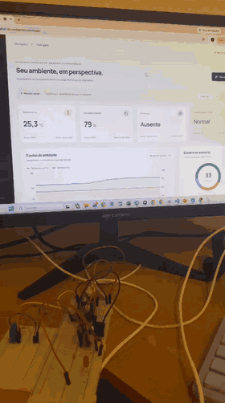</td>
    <td width="66%">
      <b>Sistema funcionando de ponta a ponta</b><br><br>
      O protótipo na bancada lê os sensores, classifica o ambiente <i>na própria placa</i>, aciona o LED e envia a leitura por Wi-Fi.
      Segundos depois, o painel publicado na Vercel mostra a mesma leitura, vinda do Supabase.<br><br>
      Nenhum computador processa os dados: o notebook só exibe o site.
    </td>
  </tr>
</table>

<table>
  <tr>
    <td colspan="2">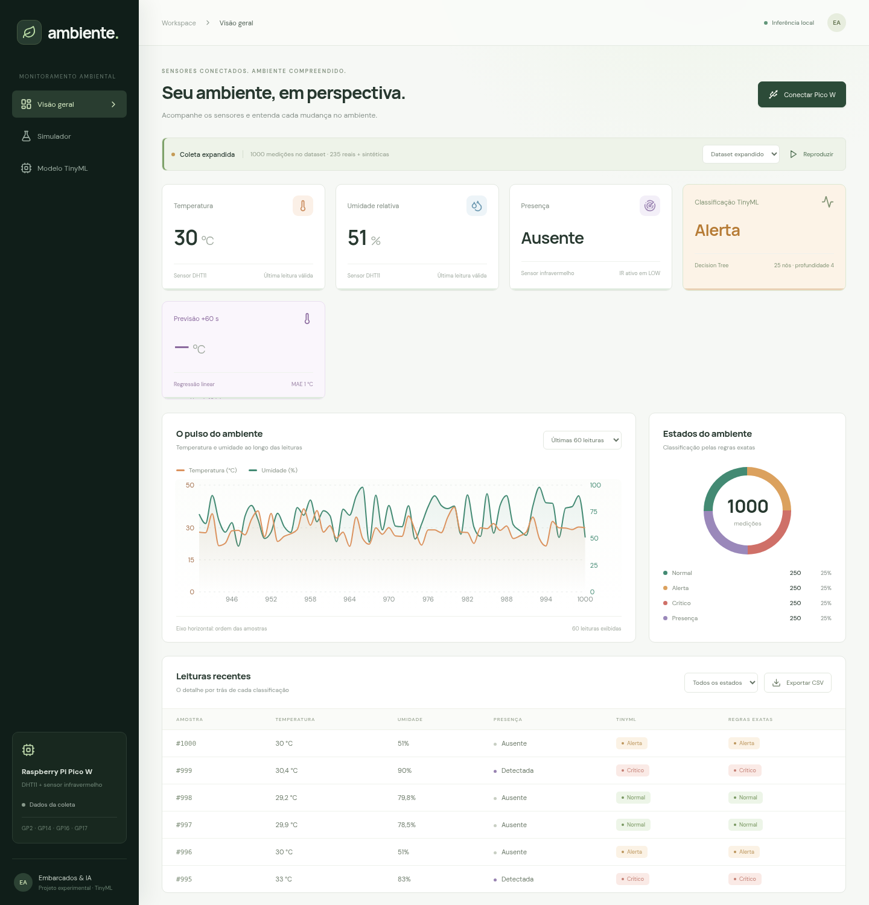</td>
  </tr>
  <tr>
    <td align="center"><b>Visão geral</b> — sensores, classificação TinyML, previsão +60 s e histórico</td>
    <td></td>
  </tr>
  <tr>
    <td width="50%">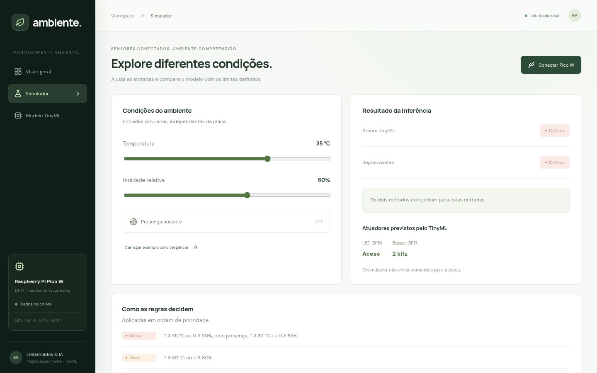</td>
    <td width="50%">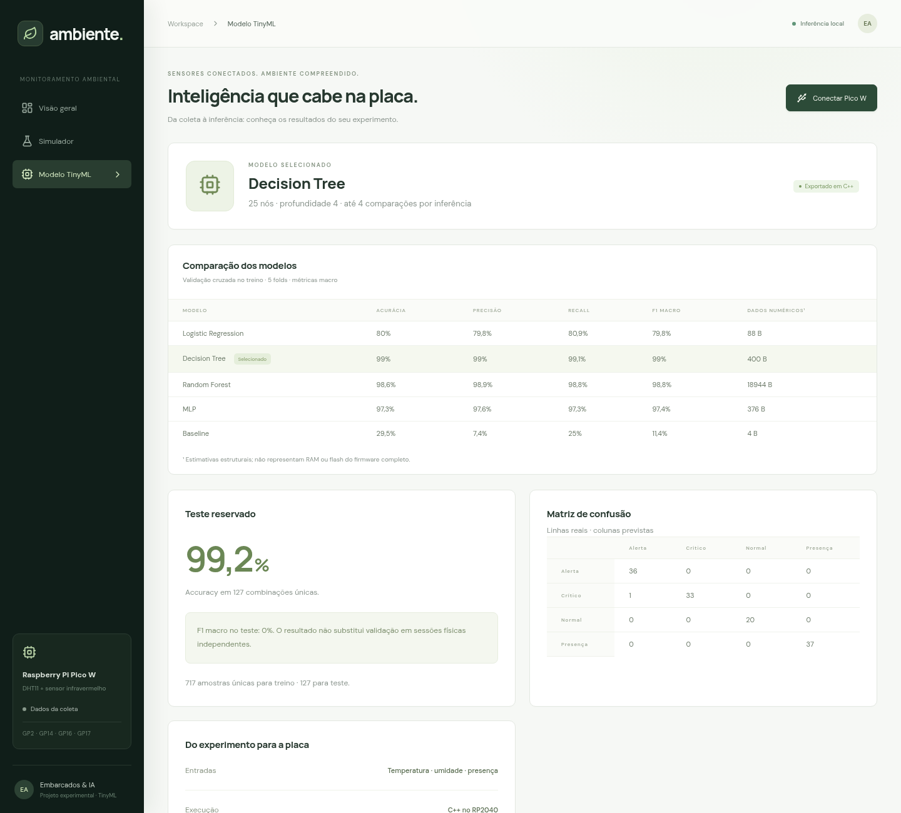</td>
  </tr>
  <tr>
    <td align="center"><b>Simulador</b> — árvore TinyML × regras exatas</td>
    <td align="center"><b>Modelo TinyML</b> — comparação e matriz de confusão</td>
  </tr>
</table>

## Do protótipo ao produto

O projeto foi construído em etapas, validando cada camada antes de avançar para a próxima.

<table>
  <tr>
    <td width="50%" align="center">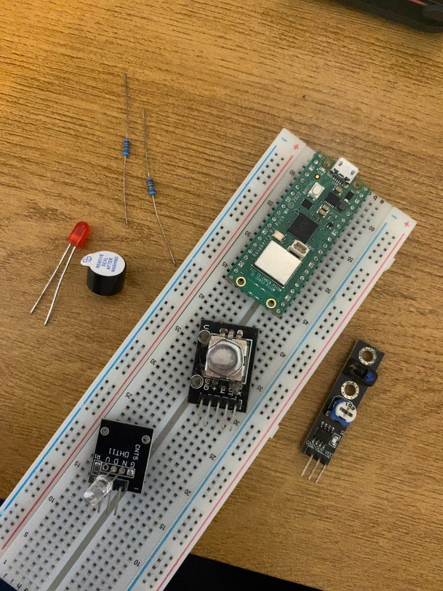</td>
    <td width="50%" align="center">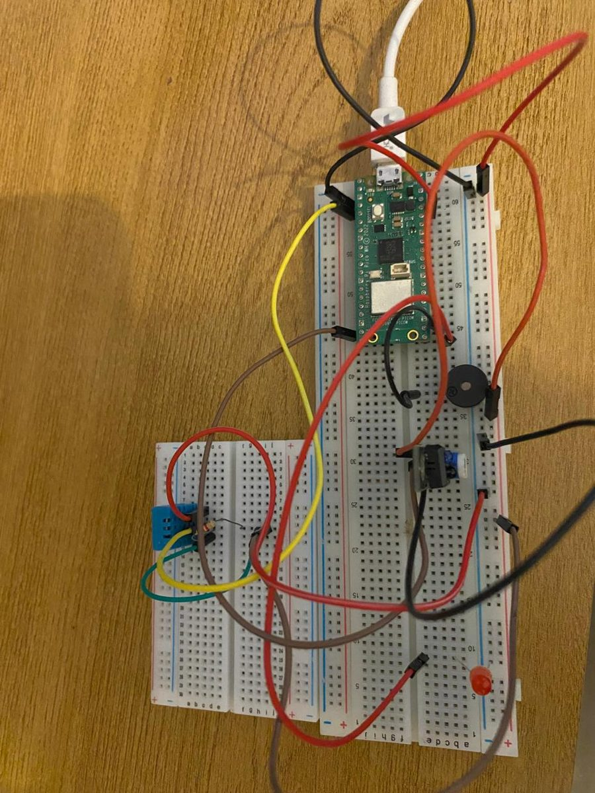</td>
  </tr>
  <tr>
    <td align="center"><b>1. Seleção dos componentes</b><br><sub>Pico W, DHT11, sensor IR, LED, buzzer e resistores</sub></td>
    <td align="center"><b>2. Montagem do protótipo</b><br><sub>Pinagem final: DHT11 GP2 · IR GP14 · LED GP16 · buzzer GP17</sub></td>
  </tr>
  <tr>
    <td width="50%" align="center">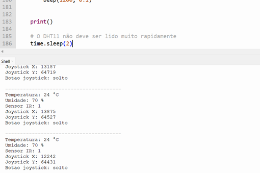</td>
    <td width="50%" align="center">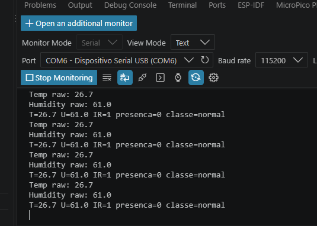</td>
  </tr>
  <tr>
    <td align="center"><b>3. Validação isolada dos sensores</b><br><sub>Cada componente testado em MicroPython (Thonny) antes de qualquer IA</sub></td>
    <td align="center"><b>4. Modelo rodando na placa</b><br><sub>Firmware C++ gravado via UF2, classe prevista na serial a 115200 baud</sub></td>
  </tr>
</table>

| Etapa | O que foi feito | Evidência |
|:---:|---|---|
| 1 | Seleção de componentes e definição da pinagem | Fotos acima, [HARDWARE.md](docs/HARDWARE.md) |
| 2 | Teste isolado de cada sensor e atuador em MicroPython | Leitura estável do DHT11; IR confirmado como ativo em nível baixo |
| 3 | Coleta de 235 medições reais com o protótipo | [`data/dataset.xlsx`](tinyml_ambiente/data/dataset.xlsx) |
| 4 | Limpeza, expansão do dataset e treinamento de 5 modelos | [METODOLOGIA.md](docs/METODOLOGIA.md) |
| 5 | Exportação da árvore para C++ e verificação contra o Python | 13.224 casos, 0 divergências |
| 6 | Gravação do firmware via BOOTSEL/UF2 e teste na serial | Saída `classe=normal` na placa |
| 7 | Nuvem (Supabase) e painel web publicado (Vercel) | [Painel ao vivo](https://classificador-de-ambiente.vercel.app) |
| 8 | Previsão temporal +60 s e fallback para regras fora do domínio | [ARQUITETURA.md](docs/ARQUITETURA.md) |

## Arquitetura

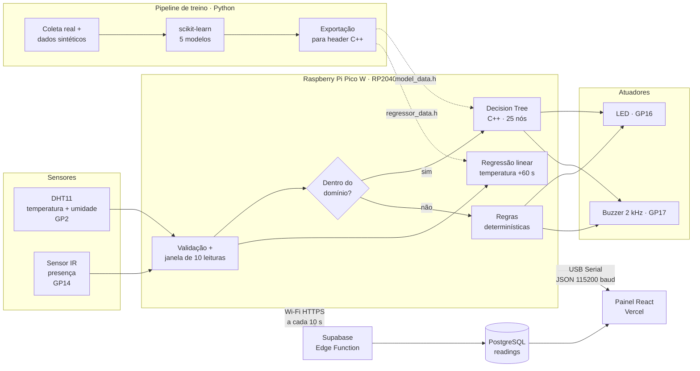

Detalhes de cada componente, protocolos e decisões de projeto em **[docs/ARQUITETURA.md](docs/ARQUITETURA.md)**.

## Como o ambiente é classificado

As classes seguem uma política de prioridade definida para o projeto (a primeira regra satisfeita vence). A árvore de decisão aprende a reproduzir essa política a partir dos dados e é o que roda na placa.

| Prioridade | Estado | Condição | Ação na placa |
|:---:|---|---|---|
| 1 | 🔴 **Crítico** | T ≥ 35 °C **ou** U ≥ 90 % **ou** (presença **e** T ≥ 32 °C) **ou** (presença **e** U ≥ 85 %) | LED aceso + buzzer |
| 2 | 🟠 **Alerta** | T ≥ 30 °C **ou** U ≥ 80 % | LED aceso + buzzer |
| 3 | 🟣 **Presença** | Pessoa detectada, sem condição anterior | — |
| 4 | 🟢 **Normal** | Demais leituras válidas | — |

> A presença de pessoas **reduz os limites** de criticidade: o sistema é mais conservador quando há alguém exposto à condição.

## Resultados

### Evolução: dos testes iniciais à versão final

A primeira versão, treinada só com as 235 medições reais, chegou a **F1 macro de 0,73**. Os testes mostraram a causa: apenas 5 exemplos de presença e nenhuma leitura acima de 35 °C. Com o dataset expandido nas regiões não cobertas e uma validação mais rigorosa, a árvore chegou a **0,99**.

| | Versão inicial | Versão final |
|---|:---:|:---:|
| Registros / combinações únicas | 235 / 79 | 1.000 / 844 |
| Exemplos da classe presença | 5 | 250 |
| Validação cruzada / amostras de teste | 2 folds / 20 | 5 folds / 127 |
| Árvore de decisão | 17 nós | 25 nós |
| **F1 macro da árvore (CV)** | **0,728** | **0,990** |

Detalhes em [METODOLOGIA.md](docs/METODOLOGIA.md#22-testes-iniciais-a-primeira-versão-do-modelo).

### Comparação de modelos

Validação cruzada estratificada (5 folds) no conjunto de treino, seguida de avaliação em teste reservado de **127 combinações únicas** nunca vistas no treino.

| Modelo | F1 macro (CV) | F1 macro (teste) | Memória estimada do modelo |
|---|:---:|:---:|---:|
| Baseline (classe constante) | 11,4 % | 11,3 % | 4 B |
| Logistic Regression | 79,8 % | 79,8 % | 88 B |
| MLP (8, 4) | 97,4 % | 98,4 % | 376 B |
| Random Forest (32 árvores) | 98,8 % | 99,3 % | 18.944 B |
| **Decision Tree (selecionado)** | **99,0 %** | **99,3 %** | **400 B** |

**Por que a árvore de decisão?** Ela empata com a Random Forest no teste usando **47× menos memória**, é totalmente interpretável, não exige normalização das entradas e executa no máximo **4 comparações** por inferência — ideal para um microcontrolador.

### Desempenho do modelo selecionado (teste reservado)

| Métrica | Valor |
|---|:---:|
| Accuracy | **99,2 %** |
| F1 macro | **99,3 %** |
| Recall da classe crítica | **97,1 %** |
| Concordância com as regras em 20.000 entradas aleatórias | **98,2 %** |

<p align="center">
  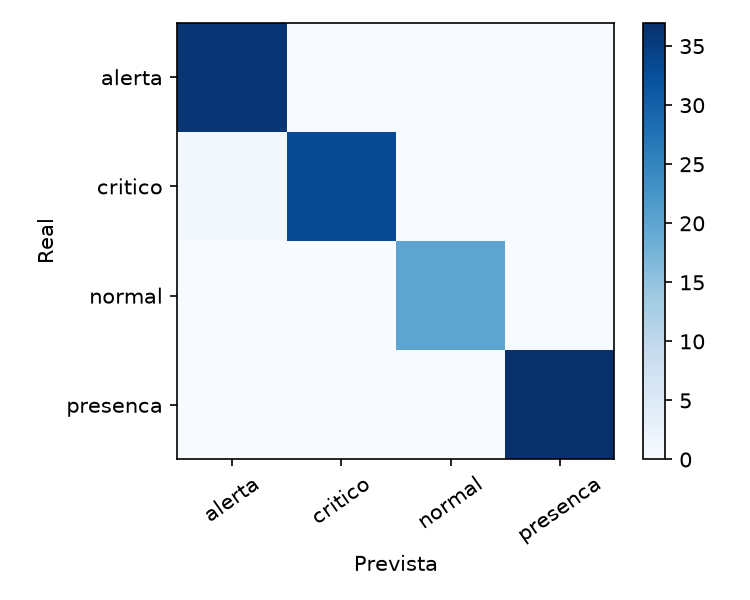
  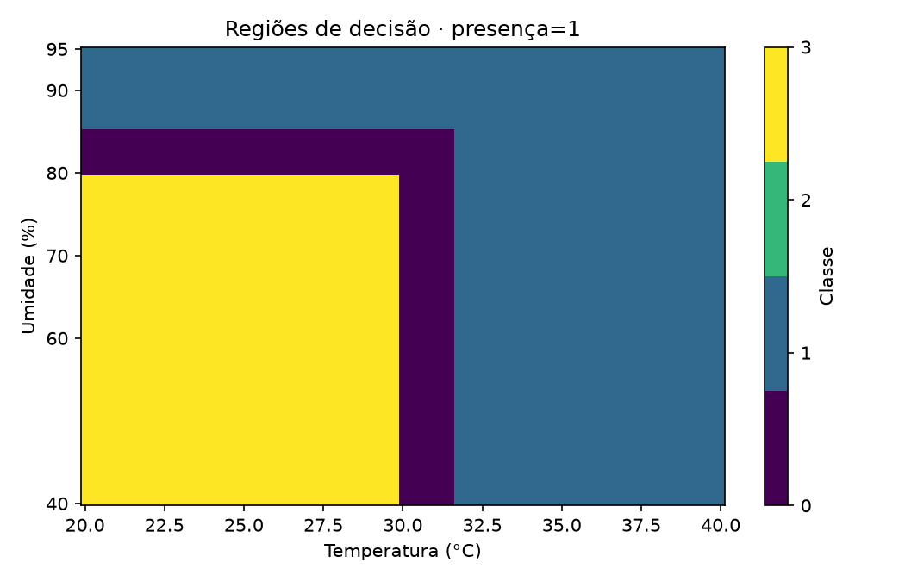
</p>

### Previsão de temperatura (+60 s)

| Modelo | MAE (teste) | RMSE (teste) | R² |
|---|:---:|:---:|:---:|
| Baseline: repetir leitura atual | 1,50 °C | 2,13 °C | 0,797 |
| Baseline: extrapolar tendência | 1,23 °C | 1,60 °C | 0,885 |
| **Regressão linear (embarcada)** | **1,02 °C** | **1,32 °C** | **0,922** |

### Custo embarcado (firmware completo compilado para o Pico W)

| Recurso | Uso | Disponível |
|---|---:|---:|
| Flash | 302 kB | 2 MB (≈ 14 %) |
| RAM estática | 69 kB | 264 kB (≈ 26 %) |

> Os valores incluem o core Arduino, drivers dos sensores, serial e atuadores — o modelo em si ocupa poucas centenas de bytes.

Metodologia completa, validação e discussão crítica em **[docs/METODOLOGIA.md](docs/METODOLOGIA.md)**.

## Tecnologias

| Camada | Tecnologias |
|---|---|
| **Hardware** | Raspberry Pi Pico W (RP2040), DHT11, sensor de presença infravermelho, LED, buzzer passivo |
| **Firmware** | C++ (Arduino-Pico), PlatformIO, Adafruit DHT, HTTPS com certificado raiz fixado, NTP |
| **Machine Learning** | Python, scikit-learn, pandas, NumPy, Matplotlib — exportação própria para headers C++ |
| **Back-end** | Supabase (PostgreSQL + Row Level Security + Edge Functions em Deno/TypeScript) |
| **Front-end** | React 19, Vite, Recharts, Lucide, Web Serial API — hospedado na Vercel |

## Como executar

### 1. Painel web

```bash
cd tinyml_ambiente/web
npm install
npm run dev        # http://127.0.0.1:5173
npm test           # testes do classificador e do parser serial
```

Para ver dados reais da placa, use Chrome ou Edge, conecte o Pico W por USB e clique em **Conectar Pico W**.

### 2. Pipeline de Machine Learning

```bash
cd tinyml_ambiente
python -m venv .venv
source .venv/bin/activate            # Windows: .venv\Scripts\activate
pip install -r requirements.txt
python training/pipeline.py          # gera dataset, treina, avalia e exporta para C++
```

### 3. Firmware

```bash
pip install platformio==6.2.0
cd tinyml_ambiente
pio run -d firmware -e picow --target upload     # árvore de decisão
pio device monitor --baud 115200
```

Também há binários prontos em [`tinyml_ambiente/firmware/dist/`](tinyml_ambiente/firmware/dist): segure **BOOTSEL**, conecte o Pico W e copie o `.uf2` para a unidade `RPI-RP2`.

Montagem, pinagem e variantes do firmware em **[docs/HARDWARE.md](docs/HARDWARE.md)**. Integração com a nuvem em **[supabase/README.md](supabase/README.md)**.

## Estrutura do repositório

```text
classificador-de-ambiente/
├── docs/                       # Documentação do projeto e imagens
│   ├── entrega/                # Apresentação (PDF/PPTX) e descrição do projeto final
│   ├── ARQUITETURA.md
│   ├── METODOLOGIA.md
│   └── HARDWARE.md
├── supabase/
│   ├── migrations/             # Tabela readings + políticas RLS
│   └── functions/ingest-reading/  # API de ingestão autenticada por token
└── tinyml_ambiente/
    ├── data/                   # Coleta original, dataset expandido e regras
    ├── training/               # Pré-processamento, treino, avaliação e exportação
    ├── models/                 # Modelos .pkl e headers C++ gerados
    ├── reports/                # Métricas, gráficos e verificações reproduzíveis
    ├── firmware/               # Firmware C++ (PlatformIO) e binários .uf2
    └── web/                    # Painel React + Vite
```

## Documentação completa

| Documento | Conteúdo |
|---|---|
| [docs/ARQUITETURA.md](docs/ARQUITETURA.md) | Componentes, fluxo de dados, formato das mensagens, API e segurança |
| [docs/METODOLOGIA.md](docs/METODOLOGIA.md) | Dados, rotulagem, treino, seleção de modelo, validação e limitações |
| [docs/HARDWARE.md](docs/HARDWARE.md) | Lista de materiais, pinagem, variantes do firmware e gravação |
| [tinyml_ambiente/README.md](tinyml_ambiente/README.md) | Relatório técnico detalhado do experimento TinyML |
| [tinyml_ambiente/web/README.md](tinyml_ambiente/web/README.md) | Guia do painel React |
| [supabase/README.md](supabase/README.md) | Passo a passo da integração com a nuvem |
| [Apresentação (PDF)](docs/entrega/Apresentacao-Classificador-de-Ambiente.pdf) · [PPTX](docs/entrega/Apresentacao-Classificador-de-Ambiente.pptx) | Slides da apresentação final |
| [Descrição do projeto final](docs/entrega/Descricao-do-projeto-final.pdf) | Enunciado e critérios de avaliação da unidade curricular |

## Decisões técnicas: quantização e if/else

<details>
<summary><b>Por que não usamos quantização (INT8)?</b></summary>
<br>

Quantização converte pesos e ativações de uma **rede neural** de float32 para inteiros de 8 bits. Ela reduz a memória em cerca de 4× e acelera multiplicações em hardware sem unidade de ponto flutuante. No nosso caso ela não traz ganho:

- **O modelo escolhido não tem pesos.** A árvore de decisão só faz comparações (`temperatura <= 29,95`). Não há multiplicações para acelerar nem tensores para comprimir: são 12 limiares e 13 folhas.
- **A memória já é desprezível.** O modelo inteiro cabe em poucas centenas de bytes, contra 264 kB de RAM disponíveis. O firmware completo usa cerca de 26 % da RAM, e quase tudo isso vem do core Arduino, do Wi-Fi e dos drivers, não do modelo.
- **Quantizar poderia introduzir erro.** Arredondar um limiar como 29,95 °C muda a fronteira de decisão. Mantendo float, a saída em C++ é **idêntica** à do scikit-learn (0 divergências em 13.224 casos).
- **A MLP, que se beneficiaria, não foi selecionada.** Ela teve F1 menor que a árvore e exigiria normalização das entradas e um runtime como o TensorFlow Lite Micro. Esse runtime ocuparia dezenas de kB de flash e uma *tensor arena* em RAM, muito mais que o próprio modelo.

Uma otimização possível no futuro seria usar **ponto fixo**, guardando a temperatura em décimos de grau num inteiro. Isso não perde nada, porque o sensor já entrega no máximo uma casa decimal.

</details>

<details>
<summary><b>Por que não escrever simplesmente if/else?</b></summary>
<br>

Há duas formas de entender a pergunta:

**1. "O modelo poderia ser if/else?"** Ele **é**. A árvore treinada é exportada automaticamente como `if/else` aninhados em [`model_data.h`](tinyml_ambiente/models/model_data.h), com até 4 comparações por inferência. A diferença está em **quem escreveu os limiares**: eles foram **aprendidos a partir dos dados** pelo algoritmo, não digitados à mão. Essa é justamente a vantagem de uma árvore de decisão para TinyML: o resultado é interpretável e roda sem nenhuma biblioteca.

**2. "Por que usar ML se as regras já existem?"** O projeto também tem as regras escritas à mão ([`rules_data.h`](tinyml_ambiente/models/rules_data.h)). Elas são usadas como **fallback** fora do domínio de treino e na variante `picow_rules`. Usamos ML porque:

- **O pipeline é o produto.** Coleta, treino, validação, exportação e verificação funcionam para *qualquer* rótulo. Com rótulos observados em campo (por exemplo, "as pessoas relataram desconforto"), não existe regra conhecida para escrever. O modelo descobre as fronteiras, e o restante do sistema continua igual.
- **Regras fixas não se adaptam.** Para outro ambiente, como um laboratório, um quarto ou um almoxarifado, basta retreinar com novos dados e regravar o firmware, sem reescrever lógica.
- **A previsão temporal não é uma regra.** Prever a temperatura em +60 s a partir de médias e tendências da janela é uma regressão aprendida, que nenhum `if` simples substitui.
- **O ML foi auditado contra as regras.** Medimos onde a árvore concorda com a política (98,2 % em 20.000 entradas) e onde diverge. Por isso o firmware usa as regras como rede de segurança.

</details>

## Limitações e próximos passos

Transparência sobre o que os resultados **não** demonstram faz parte do projeto:

- Os rótulos derivam de regras definidas pela equipe; o modelo **aprende a reproduzir essa política**, não descobre estados ambientais novos.
- Cerca de 76 % do dataset expandido é sintético (identificado pela coluna `origem`), gerado para cobrir faixas que a coleta real não alcançou.
- A coleta original não possui timestamps nem sessões independentes; a previsão temporal foi treinada com janelas sintéticas.
- O DHT11 tem precisão de ±2 °C e ±5 % UR, o que limita decisões muito próximas aos limiares.

**Próximos passos:** coletar sessões reais em ambientes diferentes com rótulos observados; trocar o DHT11 por um sensor mais preciso (ex.: SHT31); armazenar leituras offline e reenviá-las; notificações push/e-mail em eventos críticos; autenticação por usuário no painel; múltiplos dispositivos por ambiente.

## Equipe

| | |
|---|---|
| **Instituição** | SENAI Santa Catarina |
| **Curso** | Pós-graduação em Inteligência Artificial Aplicada |
| **Turma** | PG PGIA 2025/2 1 |
| **Unidade curricular** | IA Embarcada e Modelos Compactos (489780) |
| **Professor** | Rodrigo Kobashikawa Rosa |

**Integrantes**

| | Integrante |
|:---:|---|
|  | **Rafaela Santana** · [@rafaelasantana-ia](https://github.com/rafaelasantana-ia) |
|  | **Miriam Aguiar** · [@eumoas](https://github.com/eumoas) |
|  | **Sara Coutinho** · [@SaraBCoutinho] (https://github.com/SaraBCoutinho)|

---

<p align="center"><sub>Feito com sensores, dados e um microcontrolador de 264 kB de RAM.</sub></p>
