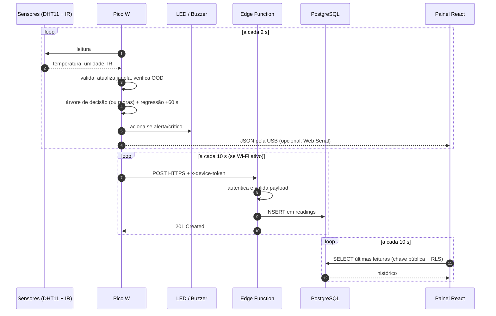

# Arquitetura do sistema

[← Voltar ao README](../README.md)

Este documento descreve os componentes do Classificador de Ambiente, como os dados fluem entre eles e as decisões de projeto que sustentam cada escolha.

## Visão geral

O sistema é organizado em quatro camadas independentes. A camada embarcada é **autossuficiente**: as demais apenas observam e armazenam o que a placa decidiu.

| Camada | Responsabilidade | Onde roda |
|---|---|---|
| **Treinamento** | Preparar dados, treinar e comparar modelos, exportar para C++ | Computador (Python) |
| **Embarcada** | Ler sensores, classificar, prever, acionar atuadores | Raspberry Pi Pico W |
| **Nuvem** | Receber, validar e armazenar leituras | Supabase (Edge Function + PostgreSQL) |
| **Visualização** | Exibir histórico, leituras ao vivo e simulações | Navegador (React, hospedado na Vercel) |



## 1. Pipeline de treinamento (`tinyml_ambiente/training/`)

Executado integralmente por `python training/pipeline.py`, de forma determinística (seed 42).

| Etapa | Script | Saída |
|---|---|---|
| Limpeza da coleta original | `preprocessing.py` | `data/clean.csv`, `reports/data_audit.json` |
| Expansão do dataset | `generate_dataset.py` | `data/dataset_expanded.csv` |
| Treino e seleção de modelos | `train.py` | `models/model.pkl`, `models/model_data.h` |
| Avaliação | `evaluate.py` | métricas, matriz de confusão, regiões de decisão |
| Concordância modelo × regras | `compare_rules.py` | `reports/rules_comparison.json` |
| Cobertura do espaço de entrada | `coverage.py` | `reports/coverage_analysis.json` |
| Regressão temporal | `generate_regression_dataset.py`, `train_regression.py` | `models/regressor_data.h` |
| Verificação Python × C++ | `verify_export.py`, `verify_regression.py` | `reports/*_verification.json` |

**Exportação sem dependências.** Em vez de TensorFlow Lite Micro, a árvore treinada é convertida automaticamente em uma função C++ com `if/else` aninhados (`model_data.h`): cada nó interno vira uma comparação e cada folha, um `return` da classe. Isso elimina tensor arena, bibliotecas de ML e conversões de tipo na placa. A equivalência é verificada compilando o header e comparando suas saídas com o scikit-learn em mais de 13 mil entradas, incluindo valores imediatamente ao redor de cada limiar.

## 2. Firmware (`tinyml_ambiente/firmware/`)

Projeto C++ sobre o core [Arduino-Pico](https://arduino-pico.readthedocs.io/) com build reprodutível via PlatformIO (plataforma e core fixados por commit).

### Ciclo principal

1. Lê o DHT11 e o sensor IR. O IR é ativo em nível baixo: `IR=0` significa presença.
2. Leitura inválida (NaN ou fora dos limites físicos) → suspende a inferência e desliga os atuadores.
3. Armazena a leitura em um **buffer circular de 10 posições** (arrays de tamanho fixo, sem alocação dinâmica) e calcula média e tendência.
4. **Verificação OOD:** se a temperatura estiver fora de [20; 39,8] °C ou a umidade fora de [40; 98] %, o modelo não é usado e a decisão cabe às regras determinísticas.
5. Executa a árvore de decisão (≤ 4 comparações) e mede o tempo de inferência em microssegundos.
6. Executa a regressão linear para estimar a temperatura em +60 s e aplica as regras sobre o valor previsto para sinalizar `alerta_futuro`.
7. Aciona LED e buzzer (2 kHz) em `alerta` ou `crítico`.
8. Emite uma linha JSON pela serial e, se habilitado, envia a leitura para a nuvem.

### Formato da mensagem serial

```json
{
  "temperatura": 30.40, "umidade": 72.00, "presenca": 0, "classe": "alerta",
  "media_temperatura": 29.88, "media_umidade": 71.40,
  "tendencia_temp": 0.12, "tendencia_umidade": -0.05,
  "temperatura_prevista_60s": 31.21, "erro_estimado_mae": 1.02,
  "previsao_pronta": true, "alerta_futuro": false,
  "tempo_regressao_us": 9, "ood": false, "fallback": false,
  "timestamp_ms": 128400
}
```

### Variantes de build

| Ambiente PlatformIO | Classificador | Nuvem | Uso |
|---|---|:---:|---|
| `picow` | Árvore de decisão | — | Experimento TinyML (padrão) |
| `picow_rules` | Regras exatas | — | Operação que exige os limites exatos |
| `picow_benchmark` | Árvore + métricas | — | Mede tempo de inferência e RAM livre |
| `picow_cloud` | Árvore de decisão | ✔ | Envio para Supabase via Wi-Fi |
| `picow_cloud_rules` | Regras exatas | ✔ | Envio para Supabase com regras exatas |

## 3. Nuvem (`supabase/`)

### Banco de dados

Tabela `public.readings`, criada por `migrations/202610030001_readings.sql`:

| Coluna | Tipo | Restrição |
|---|---|---|
| `id` | bigint identity | chave primária |
| `device_id` | text | `= 'pico-01'` |
| `temperatura_c` | real | 0 a 50 |
| `umidade_pct` | real | 0 a 100 |
| `presenca` | smallint | 0 ou 1 |
| `classe` | text | `normal`, `presenca`, `alerta`, `critico` |
| `classifier` | text | `tree` ou `rules` |
| `received_at` | timestamptz | `now()`, indexado (desc) |

As restrições `CHECK` replicam no banco a mesma validação feita na placa e na API: um dado inválido é recusado em todas as camadas.

### API de ingestão

Edge Function `ingest-reading` (Deno/TypeScript), endpoint `POST /functions/v1/ingest-reading`.

| Código | Significado |
|---|---|
| `201` | Leitura gravada |
| `400` | JSON ou valores inválidos |
| `401` | Token do dispositivo incorreto |
| `405` | Método diferente de POST |
| `413` | Payload maior que 1 kB |
| `502` | Falha ao gravar no banco |
| `503` | Configuração ausente no servidor |

### Modelo de segurança

- **Autenticação do dispositivo:** o Pico envia `x-device-token`; a função compara os hashes SHA-256 em **tempo constante**, evitando ataques de temporização. Tokens com menos de 32 caracteres são recusados.
- **Menor privilégio:** a chave administrativa (`service_role`) existe apenas no servidor. A placa conhece só o seu token; o navegador, só a chave pública.
- **Row Level Security:** escritas públicas estão revogadas; a leitura pública é limitada ao dispositivo de demonstração `pico-01`.
- **Transporte:** HTTPS com certificado raiz (GTS Root R4) embarcado no firmware e relógio sincronizado por NTP.
- **Segredos fora do Git:** `secrets.h` e `.secrets/` estão no `.gitignore`; o repositório traz apenas `secrets.example.h`.

## 4. Painel web (`tinyml_ambiente/web/`)

Aplicação React 19 + Vite, publicada como site estático na Vercel.

| Página | Função |
|---|---|
| **Visão geral** | Métricas atuais, previsão +60 s, gráfico temperatura × umidade, distribuição dos estados, tabela filtrável e exportação CSV |
| **Simulador** | Controles de temperatura, umidade e presença; compara a árvore TinyML com as regras exatas e mostra o estado dos atuadores |
| **Modelo TinyML** | Comparação dos modelos, teste reservado, matriz de confusão e resumo do deploy |

**Três fontes de dados**, selecionáveis no painel:

1. **Dataset expandido** — reprodução da coleta, sem hardware;
2. **Serial USB** — leitura direta da placa via [Web Serial API](https://developer.mozilla.org/docs/Web/API/Web_Serial_API) (Chrome/Edge), sem servidor;
3. **Nuvem · Supabase** — histórico remoto atualizado a cada 10 s.

O simulador reimplementa em JavaScript a mesma árvore exportada para C++, usando `Math.fround` para reproduzir a aritmética float32 da placa. Testes automatizados (`npm test`) cobrem o classificador e o parser serial.

## Decisões de projeto

| Decisão | Alternativa considerada | Motivo |
|---|---|---|
| Árvore de decisão exportada como C++ | TensorFlow Lite Micro + MLP | Mesmo desempenho com memória e latência muito menores; sem runtime de ML |
| Regras como fallback OOD | Confiar no modelo em todo o domínio | Uma árvore não extrapola limiares que não viu nos dados |
| Inferência na placa | Classificar na nuvem | Funciona sem internet; latência de milissegundos |
| Edge Function com token próprio | Escrita direta pela chave pública | Impede que qualquer pessoa com a URL insira dados |
| Buffer circular de tamanho fixo | Alocação dinâmica | Uso de memória previsível no microcontrolador |
