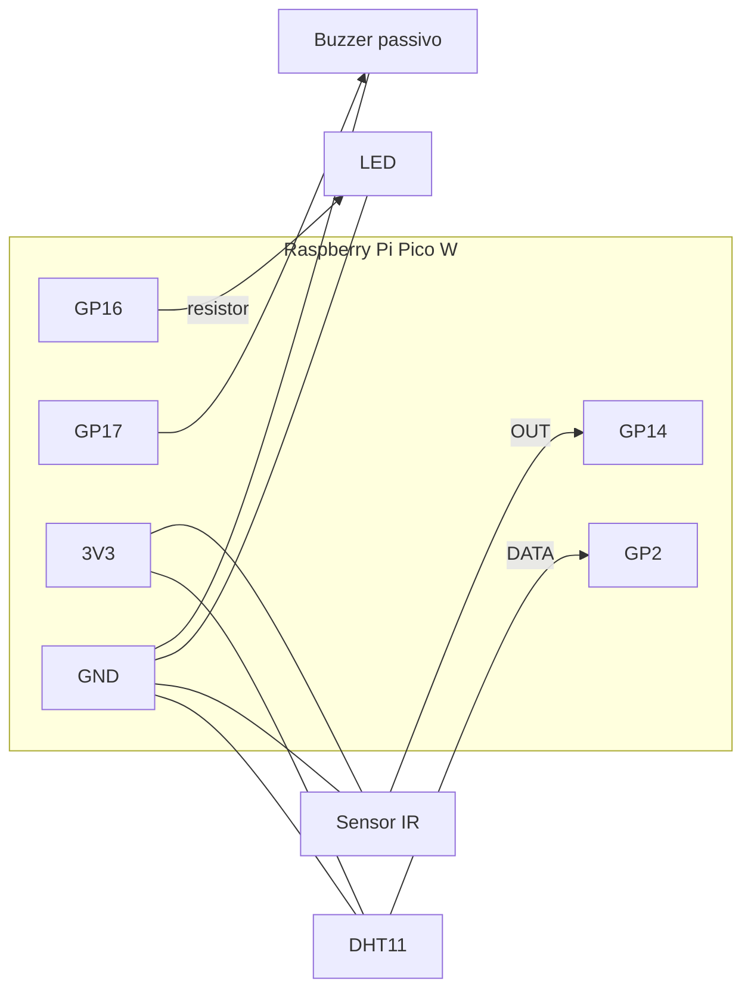

# Hardware e firmware

[← Voltar ao README](../README.md)

## Lista de materiais

| Qtd | Componente | Função |
|:---:|---|---|
| 1 | Raspberry Pi Pico W (RP2040, Wi-Fi) | Processamento, inferência e conectividade |
| 1 | Sensor DHT11 | Temperatura (0–50 °C, ±2 °C) e umidade (20–90 % UR, ±5 %) |
| 1 | Sensor de obstáculo/presença infravermelho | Detecção de presença (saída digital, ativa em nível baixo) |
| 1 | LED + resistor (220–330 Ω) | Indicador visual de alerta |
| 1 | Buzzer passivo | Alarme sonoro (2 kHz) |
| 1 | Protoboard, jumpers e cabo micro-USB | Montagem e alimentação |

## Pinagem

Numeração GPIO (não é o número do pino físico da placa).

| Componente | Sinal | GPIO |
|---|---|:---:|
| DHT11 | DATA | **GP2** |
| Sensor IR | OUT | **GP14** |
| LED | Ânodo (via resistor) | **GP16** |
| Buzzer | + | **GP17** |
| Todos | VCC | 3V3 (OUT) |
| Todos | GND | GND comum |



> Use sinais compatíveis com 3,3 V e GND comum. Para buzzer **ativo**, troque `tone/noTone` por nível lógico em `main.cpp` e, se necessário, use um transistor como estágio de acionamento.

## Comportamento dos atuadores

| Estado | LED (GP16) | Buzzer (GP17) |
|---|:---:|:---:|
| Normal | Apagado | Desligado |
| Presença | Apagado | Desligado |
| Alerta | **Aceso** | **2 kHz** |
| Crítico | **Aceso** | **2 kHz** |
| Leitura inválida | Apagado | Desligado |

## Compilar e gravar

```bash
pip install platformio==6.2.0
cd tinyml_ambiente

pio run -d firmware -e picow                    # compilar
pio run -d firmware -e picow --target upload    # gravar
pio device monitor --baud 115200                # acompanhar a saída JSON
```

Ambientes disponíveis: `picow`, `picow_rules`, `picow_benchmark`, `picow_cloud` e `picow_cloud_rules` (descritos em [ARQUITETURA.md](ARQUITETURA.md#variantes-de-build)). Para os ambientes com nuvem, copie `firmware/secrets.example.h` para `firmware/secrets.h` e preencha Wi-Fi, URL da função e token — veja [supabase/README.md](../supabase/README.md).

### Gravar um binário pronto (sem compilar)

1. Segure o botão **BOOTSEL** e conecte o Pico W ao computador.
2. A placa aparece como a unidade **RPI-RP2**.
3. Copie **um** arquivo de [`tinyml_ambiente/firmware/dist/`](../tinyml_ambiente/firmware/dist):
   - `tinyml_tree.uf2` — árvore de decisão;
   - `exact_rules.uf2` — regras exatas;
   - `tinyml_tree_benchmark.uf2` — árvore com medição de desempenho.
4. A placa reinicia automaticamente com o novo firmware.

> Gravar o firmware C++ substitui a instalação MicroPython da placa. Faça backup dos arquivos que quiser manter.

## Diagnóstico pela serial

| Saída | Significado |
|---|---|
| Linha JSON com `"classe"` | Leitura e inferência normais |
| `DHT11_READ_ERROR` | Falha de leitura do sensor — confira fiação e alimentação |
| `"ood": true` | Leitura fora do domínio de treino; decisão feita pelas regras |
| `{"tipo":"benchmark", ...}` | Tempo médio/mín./máx. de inferência e RAM livre (`picow_benchmark`) |
| `CLOUD_HTTP=201` | Leitura enviada para a nuvem com sucesso |
| `CLOUD_HTTP=401` | Token do dispositivo incorreto |
