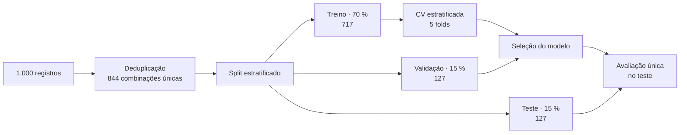
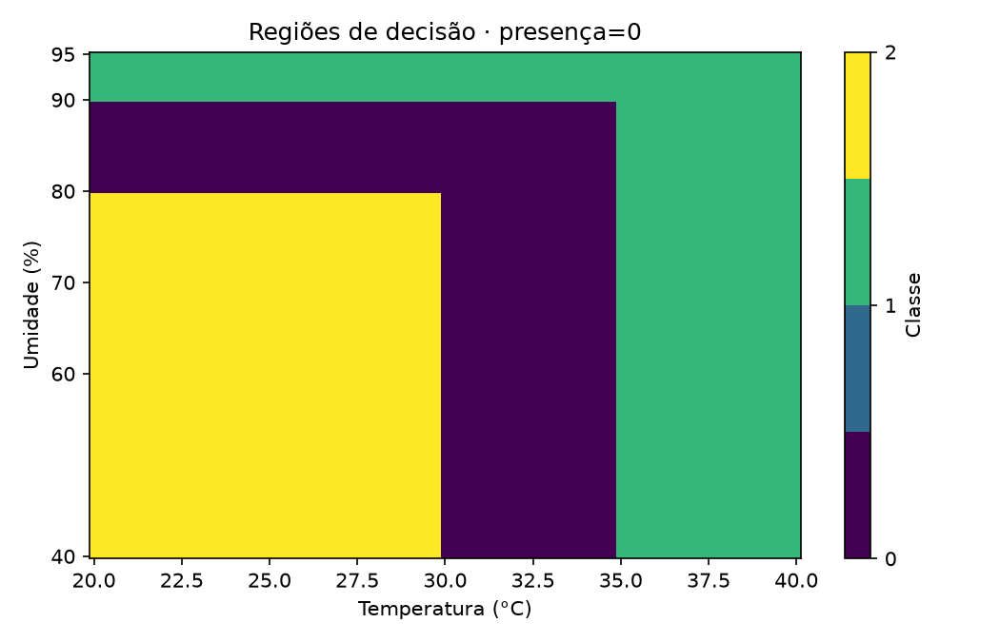
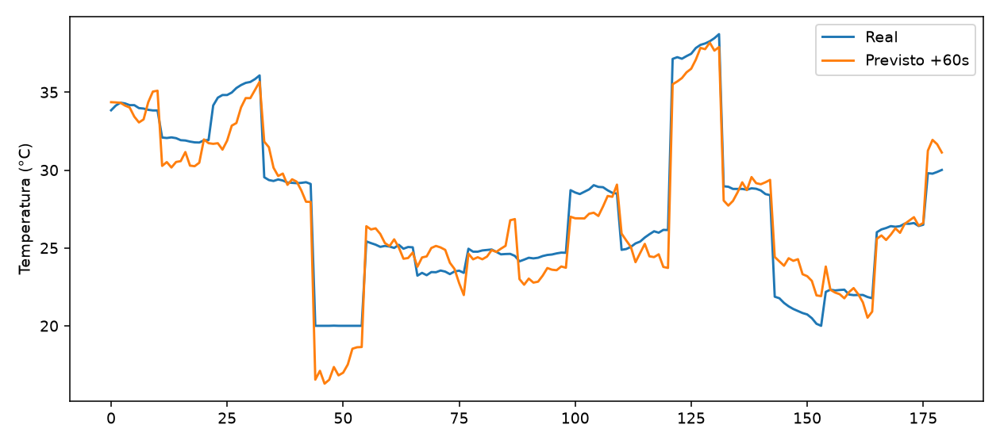
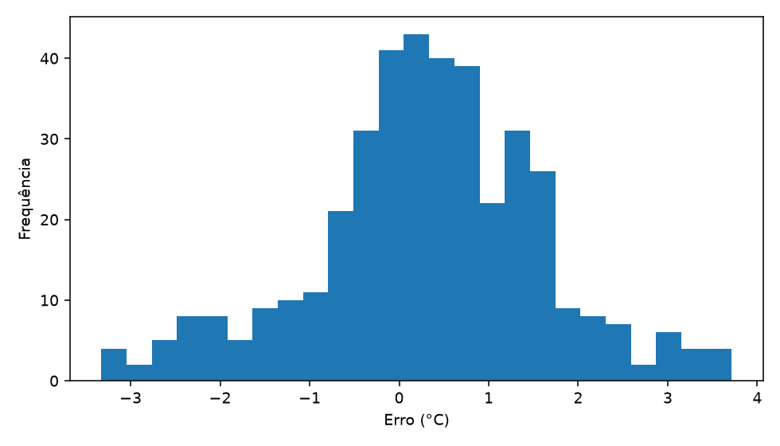

# Metodologia de Machine Learning

[← Voltar ao README](../README.md)

Este documento descreve como os dados foram obtidos e preparados, como os modelos foram treinados e selecionados, como os resultados foram validados e quais são os limites dessas conclusões. Todos os números vêm dos relatórios gerados automaticamente em [`tinyml_ambiente/reports/`](../tinyml_ambiente/reports).

## 1. Formulação do problema

| | |
|---|---|
| **Tarefa principal** | Classificação multiclasse supervisionada |
| **Entradas** | `temperatura_c` (°C), `umidade_pct` (%), `presenca` (0/1) |
| **Saída** | `normal`, `presenca`, `alerta`, `critico` |
| **Tarefa secundária** | Regressão da temperatura em +60 s a partir de uma janela de 10 leituras |
| **Restrição** | O modelo precisa caber e executar em tempo real em um RP2040 (264 kB de RAM, sem unidade de ponto flutuante) |

As classes são definidas por uma **política de prioridade** ([`data/rules.json`](../tinyml_ambiente/data/rules.json)). O objetivo do modelo é aprender essa política a partir dos dados de forma compacta e verificável — um cenário típico de *knowledge distillation* de regras para um classificador embarcado.

## 2. Dados

### 2.1 Coleta real

A coleta foi feita com o próprio protótipo (Pico W + DHT11 + IR) e registrada pelo console MicroPython.

| Atributo | Valor |
|---|---|
| Medições válidas | 235 |
| Combinações únicas (T, U, presença) | 79 |
| Temperatura | 24 a 33 °C (média 27,2 °C) |
| Umidade | 51 a 98 % (média 67,2 %) |
| Presença detectada | 23 medições |

**Limpeza:** o parser extrai o CSV embutido no log, descarta mensagens do sistema (`MPY: soft reboot`), normaliza nomes de colunas, converte o IR ativo-baixo em `presenca` e remove leituras fora dos limites físicos (T ∈ [0; 50] °C, U ∈ [0; 100] %). Inconsistências entre IR e presença interrompem o pipeline em vez de serem ignoradas.

**Problema identificado:** a coleta real é **desbalanceada** (apenas 5 registros da classe `presenca`) e **não cobre** temperaturas ≥ 35 °C. Um modelo treinado só com ela não teria como aprender esses limiares.

### 2.2 Expansão do dataset

Para cobrir o espaço de entrada, `generate_dataset.py` gera amostras sintéticas de forma determinística, concentrando parte delas **próximo aos limiares** de decisão, onde o modelo tem mais chance de errar.

| | Real | Sintético | Total |
|---|---:|---:|---:|
| Registros | 235 | 765 | **1.000** |
| Por classe | — | — | 250 cada |

A coluna `origem` identifica a procedência de cada linha, permitindo auditar e filtrar os dados sintéticos. Além disso, um **conjunto de generalização independente** com 240 combinações nunca usadas no treino é gerado separadamente (`data/processed/test_generalization.csv`).

## 3. Protocolo experimental

Cuidados adotados para evitar resultados otimistas:

- **Deduplicação antes da separação:** a mesma combinação (T, U, presença) nunca aparece ao mesmo tempo em treino e teste — sem isso, 156 duplicatas da coleta real inflariam as métricas.
- **Estratificação** em todos os splits e folds, preservando a proporção das classes.
- **Normalização dentro do fold:** Logistic Regression e MLP usam `Pipeline` do scikit-learn, de modo que o escalonamento é ajustado apenas nos dados de treino de cada fold.
- **Teste usado uma única vez**, depois da escolha do modelo, sem retreinar.
- **Métricas macro** (F1, precisão, recall), que dão o mesmo peso a todas as classes, e acompanhamento específico do **recall da classe crítica** — o erro mais caro é deixar de alertar uma situação crítica.
- **Baseline de classe constante**, para mostrar quanto cada modelo de fato acrescenta.

## 4. Modelos comparados

| Modelo | Por que foi testado | Custo na placa |
|---|---|---|
| Baseline (classe constante) | Referência mínima | Nenhum |
| Logistic Regression | Modelo linear simples | Escalonamento + produtos escalares |
| Decision Tree | Interpretável, sem escalonamento | Até 4 comparações |
| Random Forest (32 árvores) | Ensemble robusto | 32 árvores, centenas de nós |
| MLP (8, 4) | Rede neural compacta | 88 parâmetros, 72 multiplicações + ativações |

### Resultados da validação cruzada (5 folds) e teste

| Modelo | F1 macro CV | Desvio | F1 macro teste | Bytes estimados |
|---|:---:|:---:|:---:|---:|
| Baseline | 0,114 | 0,001 | 0,113 | 4 |
| Logistic Regression | 0,798 | 0,024 | 0,798 | 88 |
| MLP | 0,974 | 0,022 | 0,984 | 376 |
| Random Forest | 0,988 | 0,009 | 0,993 | 18.944 |
| **Decision Tree** | **0,990** | **0,006** | **0,993** | **400** |

A Logistic Regression fica muito atrás porque as fronteiras entre as classes são **eixo-alinhadas e com interações** (a presença muda os limiares), algo que um modelo linear não representa bem — e que uma árvore representa naturalmente.

### Escolha da profundidade

| Profundidade máxima | Nós | F1 macro CV | Recall crítico CV |
|:---:|:---:|:---:|:---:|
| 2 | 7 | 0,757 | 0,500 |
| 3 | 15 | 0,901 | 0,756 |
| **4** | **25** | **0,990** | **0,987** |
| 5 a 10 | 25 | 0,990 | 0,987 |

A partir da profundidade 4 a árvore não cresce mais: ela já captura toda a estrutura das regras. Profundidade 4 significa **no máximo 4 comparações por inferência**.

### Critério de seleção

O modelo selecionado é o mais simples cujo F1 macro fica a até 0,03 do melhor, considerando também o recall crítico, a estabilidade entre folds e o custo embarcado. A **Decision Tree** foi a melhor em F1 macro na validação cruzada, teve o menor desvio e ocupa 47× menos memória que a Random Forest.

## 5. Avaliação do modelo selecionado

### Teste reservado (127 combinações únicas)

| Classe | Precisão | Recall | F1 | Suporte |
|---|:---:|:---:|:---:|:---:|
| Alerta | 0,973 | 1,000 | 0,986 | 36 |
| Crítico | 1,000 | 0,971 | 0,985 | 34 |
| Normal | 1,000 | 1,000 | 1,000 | 20 |
| Presença | 1,000 | 1,000 | 1,000 | 37 |
| **Macro** | **0,993** | **0,993** | **0,993** | 127 |

Accuracy: **99,2 %**. O único erro foi um caso `crítico` classificado como `alerta`, ou seja, ainda com LED e buzzer acionados.

  

### Regiões de decisão

As figuras mostram como a árvore divide o plano temperatura × umidade sem e com presença. Note como os limites de `crítico` se deslocam quando há uma pessoa no ambiente.

  
  

### Concordância com a política em todo o domínio

Para medir o comportamento fora das amostras de teste, o modelo foi comparado às regras em **20.000 entradas aleatórias** (T ∈ [20; 40] °C, U ∈ [40; 95] %, presença ∈ {0, 1}):

- Concordância: **98,2 %** (F1 macro 0,983);
- 362 divergências (1,8 %), concentradas em faixas estreitas próximas aos limiares.

Esse resultado motivou duas salvaguardas no firmware: o **fallback para regras fora do domínio de treino** e a variante de build `picow_rules`, para cenários que exigem os limites exatos.

## 6. Regressão temporal (+60 s)

| | |
|---|---|
| **Janela** | 10 leituras mais recentes |
| **Features** | Leituras atuais, médias da janela, variação, tendência e quantidade de presença (10 no total) |
| **Dados** | 1.980 janelas sintéticas em 180 sessões |
| **Split** | Por sessão: 60 % treino, 20 % validação, 20 % teste — nenhuma sessão aparece em dois conjuntos |

| Modelo | MAE teste | RMSE teste | R² teste |
|---|:---:|:---:|:---:|
| Baseline: leitura atual | 1,497 | 2,132 | 0,797 |
| Baseline: extrapolar tendência | 1,227 | 1,602 | 0,885 |
| Árvore de regressão | 1,320 | 1,745 | 0,864 |
| Random Forest | 0,994 | 1,404 | 0,912 |
| Ridge | 1,015 | 1,320 | 0,922 |
| **Linear (selecionado)** | **1,015** | **1,320** | **0,922** |

A regressão linear foi escolhida porque fica a até 5 % do melhor MAE de validação e é a mais simples de embarcar: 10 coeficientes e um intercepto, executados em poucos microssegundos.

  
  

## 7. Do Python para o microcontrolador

| Verificação | Resultado |
|---|---|
| Árvore C++ × scikit-learn | 0 divergências em 13.224 entradas (grade completa + vizinhança dos limiares) |
| Regras C++ × regras Python | 0 divergências |
| Entradas inválidas | Rejeitadas pelo C++ |
| Regressão C++ × Python | Registrada em `reports/regression_export_verification.json` |
| Firmware compilado (`picow`) | 302 kB de flash (≈ 14 %), 69 kB de RAM estática (≈ 26 %) |

Os limiares são exportados com precisão completa e as entradas são tratadas como float32, reproduzindo exatamente a aritmética do scikit-learn.

## 8. Reprodutibilidade

- Seed fixa (42) em todas as etapas aleatórias;
- Versões das bibliotecas fixadas em `requirements.txt`;
- Hash SHA-256 dos dados e das regras registrado em `reports/training.json`;
- Plataforma e core do PlatformIO fixados por commit;
- Um único comando (`python training/pipeline.py`) regenera dataset, modelos, headers e relatórios.

## 9. Ameaças à validade

| Limitação | Impacto | Como mitigar |
|---|---|---|
| Rótulos derivados de regras | O modelo aprende a política definida, não estados ambientais "verdadeiros" | Coletar rótulos observados de forma independente |
| 76 % dos dados são sintéticos | Métricas podem ser otimistas em relação ao mundo real | Ampliar a coleta real, sobretudo perto dos limiares |
| Sem timestamps na coleta original | Não há validação por sessão para a classificação | Registrar sessões e reservar sessões inteiras para teste |
| Regressão treinada com janelas sintéticas | MAE real pode ser diferente | Coletar séries temporais reais |
| Precisão do DHT11 (±2 °C, ±5 % UR) | Decisões próximas aos limiares são sensíveis ao ruído | Sensor mais preciso ou histerese nos limiares |
| Teste físico do benchmark pendente | Latência medida apenas no ambiente `picow_benchmark` | Registrar tempos reais na placa |

O projeto é uma **prova de conceito acadêmica** de TinyML. Os resultados demonstram que é viável embarcar um classificador preciso, verificável e econômico em um microcontrolador de baixo custo; a validação em campo é o próximo passo natural.
